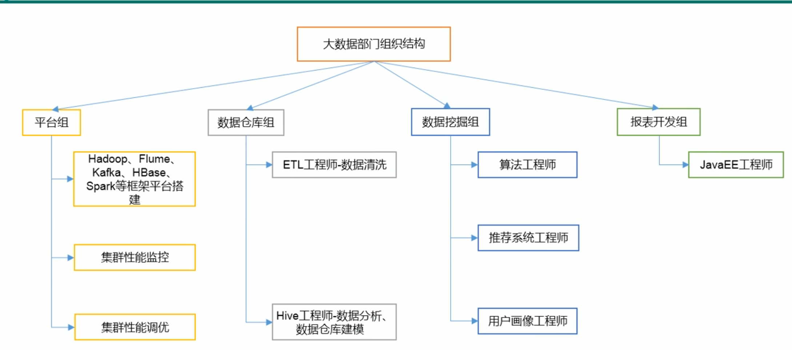
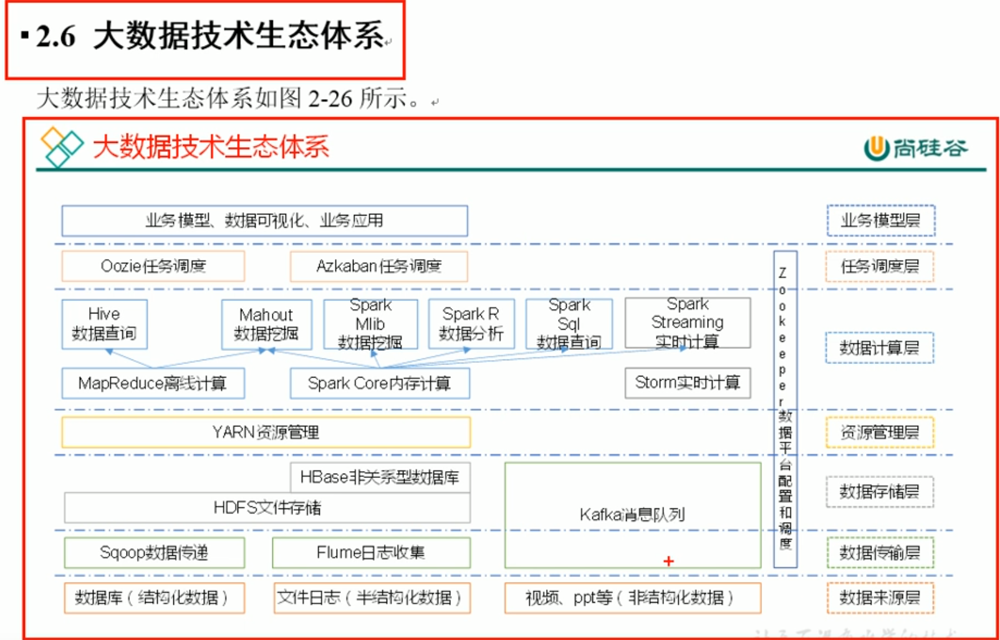

- size:
    - bit, Byte, KB, G T P E Z Y B N D

- 4V:
    - volume(大量)
    - velocity(高速)
    - variety(多样性)
        - 结构化
        - 非结构化
            - 音视频, 图片, 日志, 地理位置等
    - value(低价值密度)
        - 对数据提纯, 是当选待解决的难题

- 使用场景
    - 物流仓储
        - 助力精细化运营, 提升销量, 节约成本
    - 零售
    - 旅游
    - 商品广告推荐
    - 保险, 金融, 房地产
    - 人工智能

- 组织架构

- Hadoop 基本介绍
  - apache 基金会
  - 分布式系统
  - 基础架构
  - 主要解决: 海量数据存储和海量数据分析
  - hadoop 通常指 hadoop 生态圈
    - hbase, hive, spark等
  - History:
    - lucene: 全文搜索, 实现与 Google 类似的全文搜索功能
    - Google 大数据论文:
      - GFS --> HDFS
      - Map-Reduce --> MR
      - BigTable --> HBase
  - 三大发行版本
    - Apache
      - 原始, 入门学习好
    - Cloudera
      - 大型企业用的多(收费 IBM)
    - Hortonworks
      - 文档好

- Hadoop 优势
  - 高可靠: 数据基本不会丢失
  - 高扩展: 在集群间动态扩展结点
  - 高效性: 并行工作, 速度快
  - 高容错性: 自动重新分配失败任务

- Hadoop 1.x 和 2.x 的区别
  - Hadoop 1.x 的组成
    - MapReduce: 计算+资源调度
    - HDFS: 数据存储
    - Common: 辅助工具
    - 耦合性高
  - Hadoop 2.x 的组成
    - MapReduce: 计算
    - Yarn: 资源调度
    - HDFS: 数据存储
    - Common: 辅助工具
    - 耦合性低

- 结构
  - HDFS
    - NameNode(nn): 存储文件的元数据, 文件名, 目录等
    - DataNode(dn): 在本地文件系统存储文件块数据, 以及块数据的校验和
    - Second NameNode(2nn): 用来监控 HDFS 状态的辅助后台程序, 每隔一段时间获取 HDFS 元数据的快照
  - YARN
    - 
  - MapReduce
    - Map: 分
    - Reduce: 合

- 大数据技术生态体系
  - 

- 安装 Hadoop
  - 安装 JDK
    - 配置 JAVA_HOME
  - 安装 Hadoop
    - 配置 Hadoop_Home?