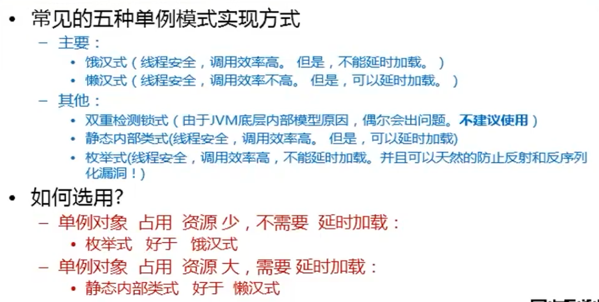

- 核心作用
  - 保证一个类只有一个实例, 并且提供一个访问该实例的全局访问点

- 常见应用场景
  - windows task manager
  - windows recycle bin

- 优点:
  - 减少了系统性能开销

- 常见五种单例模式实现方式
  - 饿汉式: 线程安全, 调用效率高, 不能延时加载
    - 
  - 懒汉式: 线程安全, 调用效率不高, 可以延时加载
  - 双重检测锁式: 由于 JVM 底层内部模型原因, 偶尔会出问题, 不建议使用
  - 静态内部类式: 线程安全, 调用效率高, 可以延时加载
  - 枚举单例: 线程安全, 调用效率高, 不能延时加载

