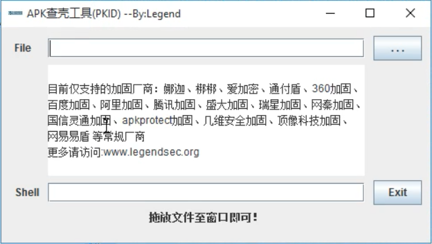
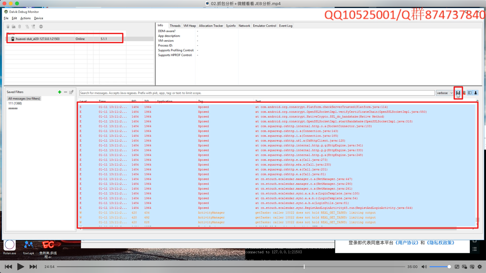
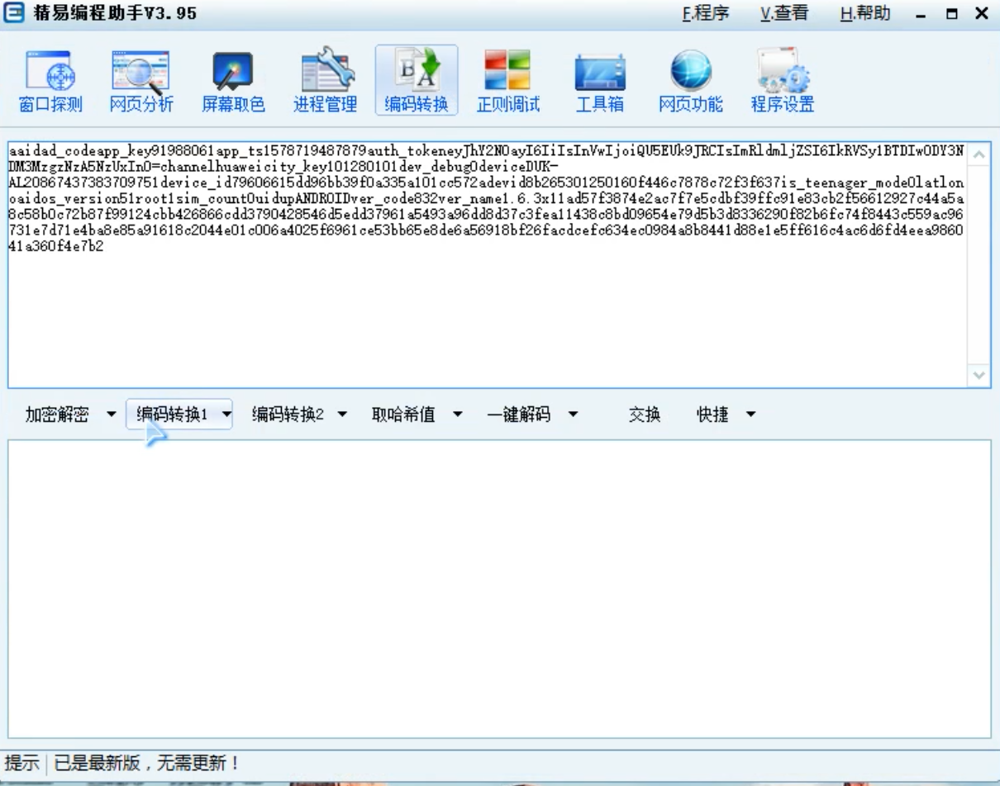
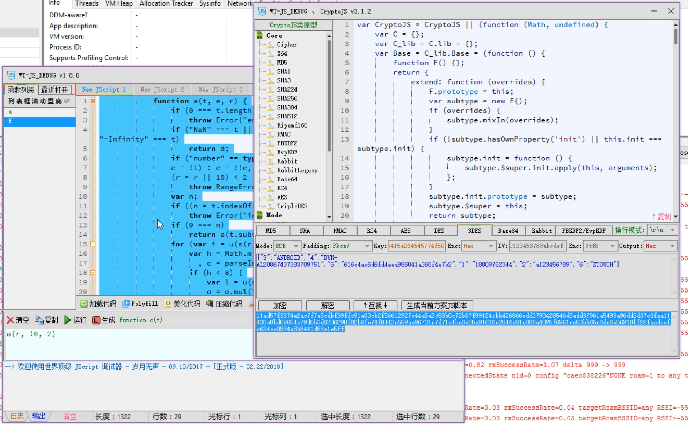
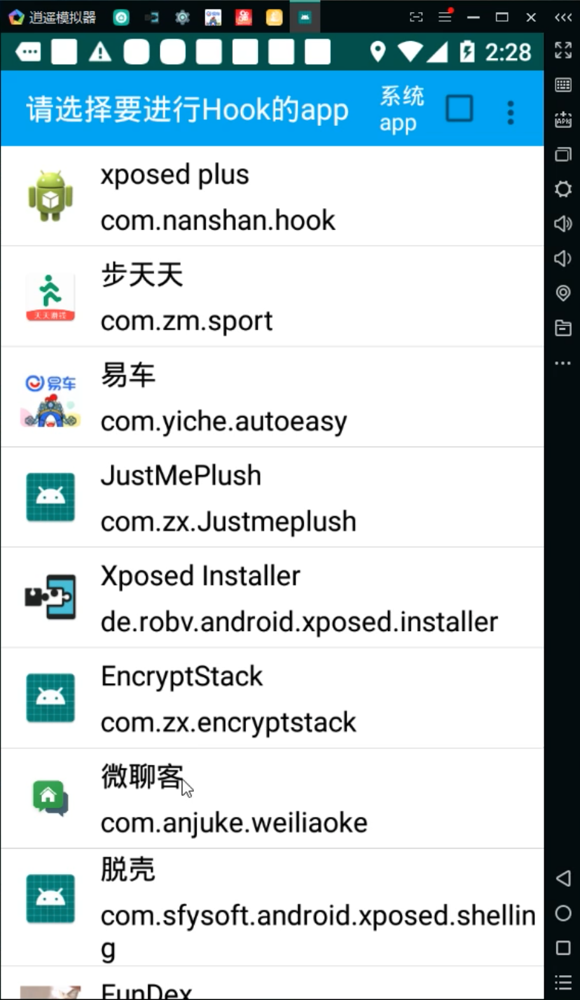
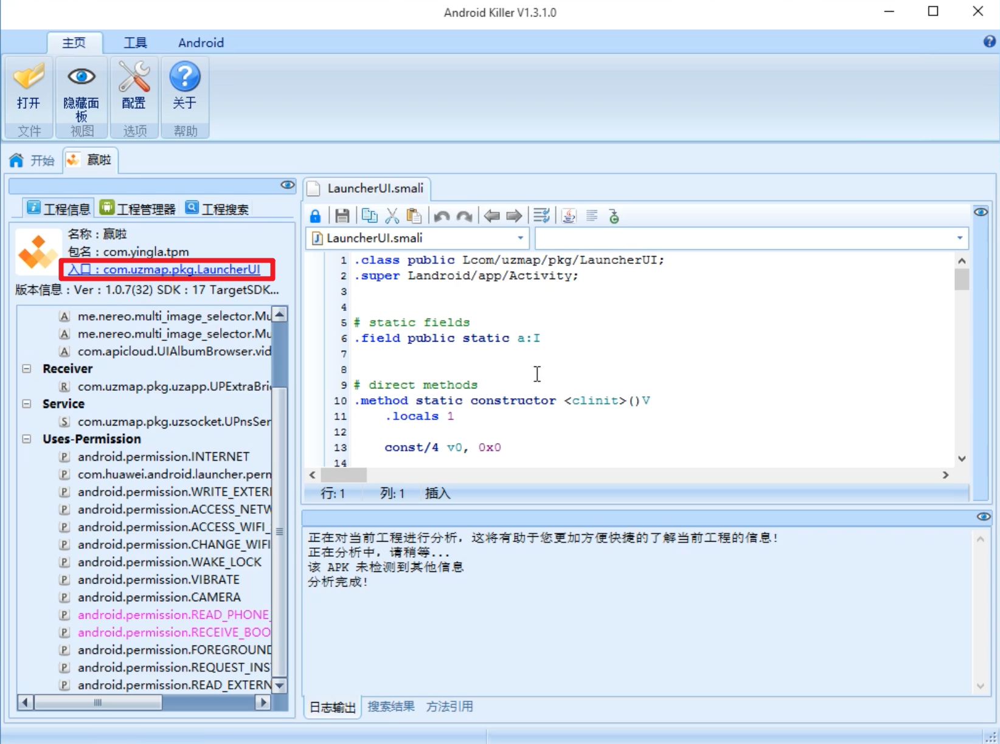

### 逆向步骤

- 查壳
  - 脱壳
  - Apk 查壳工具
    - 
- apk 拖入 JEB 分析
  - 全局搜索
    - api 网址
    - 关键词
    - 找不到的话, 尝试 ddms 查看日志 
    - 查看控件
      - class: android.webkit.WebView -> 网页 
  - 右键 -> 反编译
  - 双击跟进
  - 分析(需要 java 基础)
  - JEB -> apk Attach 
    - 开启全局调试: 
      - adb push tcpdump /data/local/tcpdump
      - adb shell [-s ZX1G22QXW6] & cd /data/local
      - chmod 777 tcpdump
      - ./tcpdump
      - ./mprop ro.debuggable 1
      - getprop ro.debuggable (1)
  - xposed 模块安装 (xposed plus: my name is nanshan)
  - sdk -> adt -> sdk -> tools -> ddms.bat
    - Hook 一些加密参数的值
  - DDMS[如果挂掉可能需要重开]
    - 
  - 精易编程助手 V3.95 (加密解密, 哈希等)
    - 
  - WT-JS_DEBUG v1.8.3
    - 
  - 易语言(加密狗版)- windows窗口程序
- 其他工具
  - 证书信任
    - 
  - jadx-gui
  - 手机抓包工具(主要针对需要关闭代理的 App)
    - HttpCanary
    - http analyzer v7(PC端显示 )
- 调试 H5 的 App
  - 解压
  - .apk/asserts/widget/..html
  - Android Killer 寻找入口
    - 
