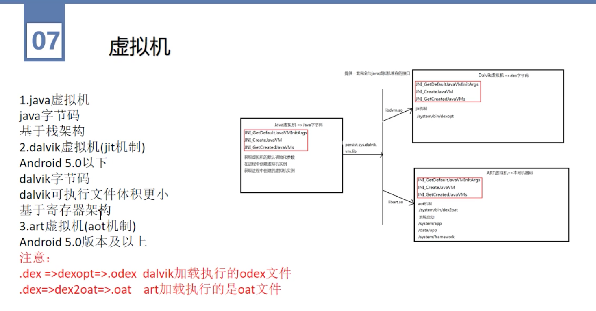
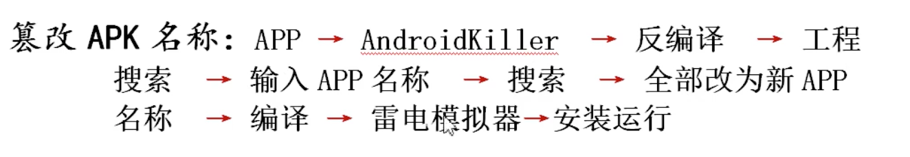
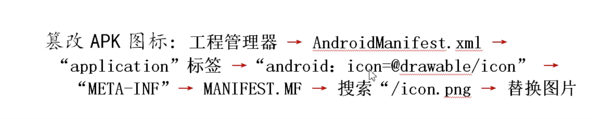
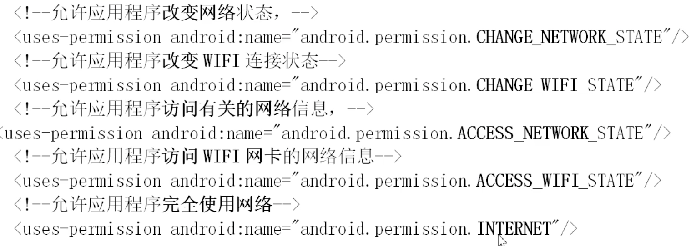

## 环境安装
- JAVA 
  - jdk
  - jre
- Android
  - sdk
  - ndk
- 

## apk 结构
- lib
  - .so 动态库
- assets
  - 静态资源
- META-INF
  - 签名文件夹
  - MANIFEST.MF
  - MYCERT.RSA
  - MYCERT.SF
  - 
- res
- 打包流程
  - 

## apk 安装
- /data/app/xx.apk
- /data/dalvik-cache/x86
- /data/data/package_name
- /data/system/packages.xml 
- /system/app system app
- 

## 虚拟机
- 
- Android 5.0 之后就不一样了
- 底层暴露出的接口是一样的, 开发不受影响 

## Android Killer
- 只有 windows 有
- mac 用 [Android Crack Tool](https://github.com/Jermic/Android-Crack-Tool/releases)
- 更新 Apk tool 工具 
- 替换 Android killer/cfgs/injectcode (插件)
- 
- 更改 app 名称, 图标
- 
- 
- 网络有关权限
- 
- 入口文件, 同时有 `main` 和 `LAUNCHER`
  ```xml
  <activity-alias android:theme="@style/lo" android:name="com.ss.android.ugc.aweme.splash.SplashActivity" android:screenOrientation="portrait" android:targetActivity="com.ss.android.ugc.aweme.main.MainActivity">
    <intent-filter>
        <action android:name="android.intent.action.MAIN"/>
        <category android:name="android.intent.category.LAUNCHER"/>
    </intent-filter>
  </activity-alias>
  ```