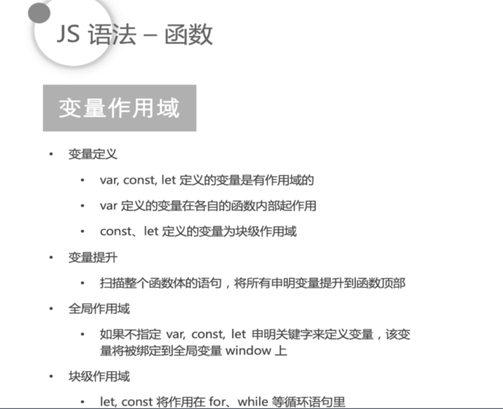
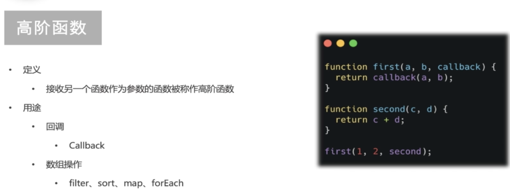
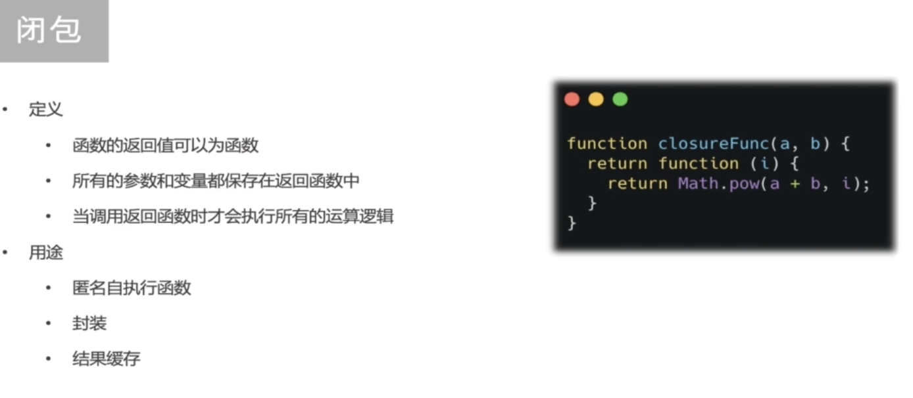
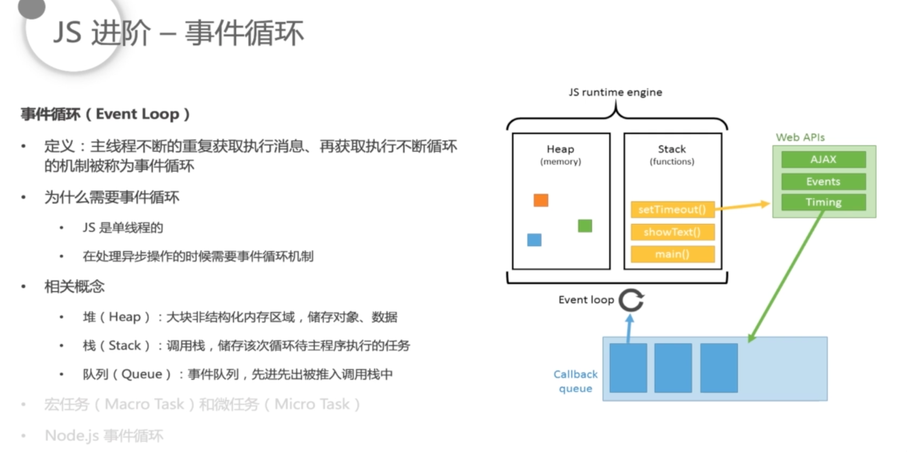
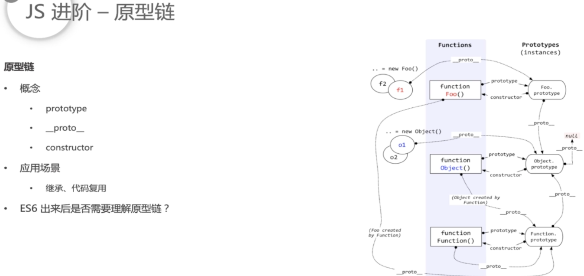
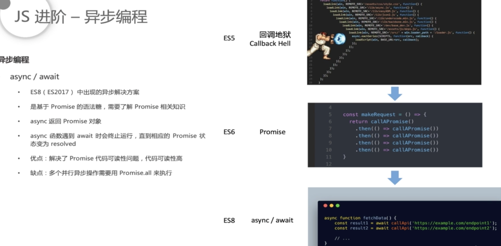
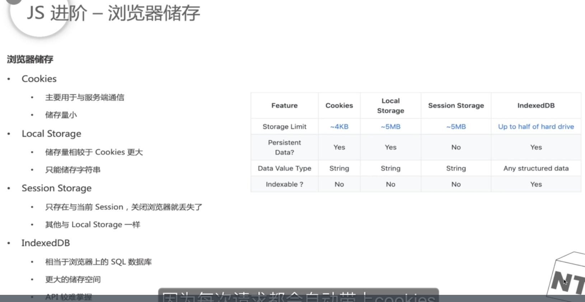
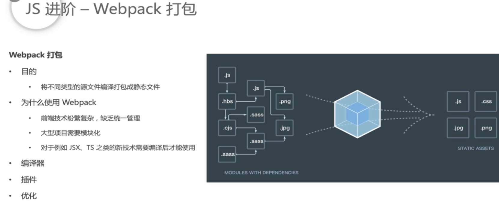

# 函数

### 定义

- ```js
  function F(){}; // 函数声明优先级最高, 直接执行
  const f = function (){}; // 变量函数, 有执行顺序
  (function (){}()); // 匿名函数
  ```

### [变量作用域](https://juejin.im/post/5b762164e51d4566877c1739)



### 高阶函数



### 闭包



### 特殊对象


# 进阶

### 事件循环




### 原型链




### 异步编程




### 浏览器储存




### 跨域


### Webpack 打包




### 总结


