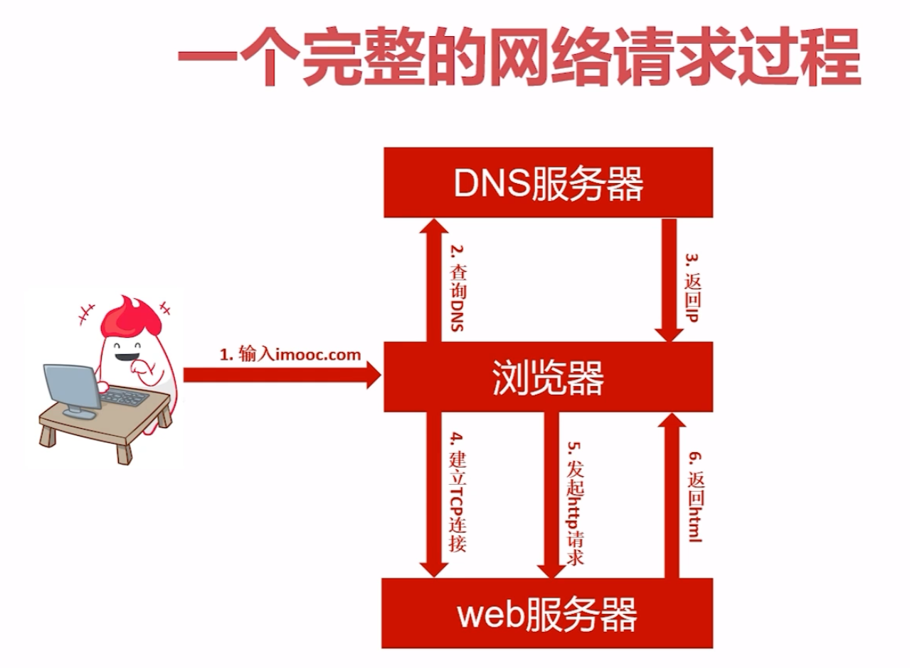
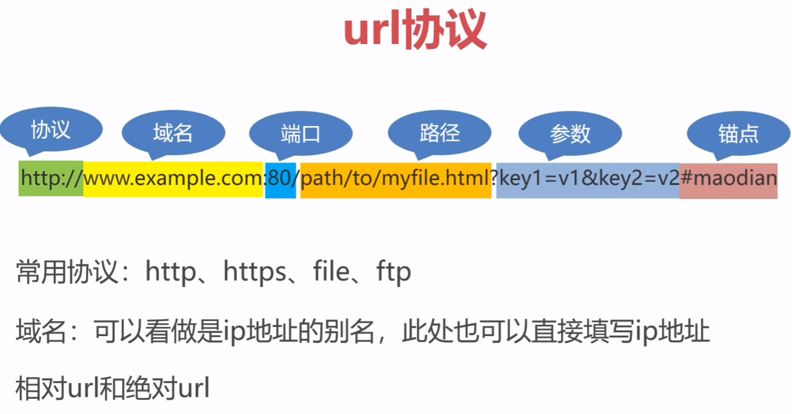
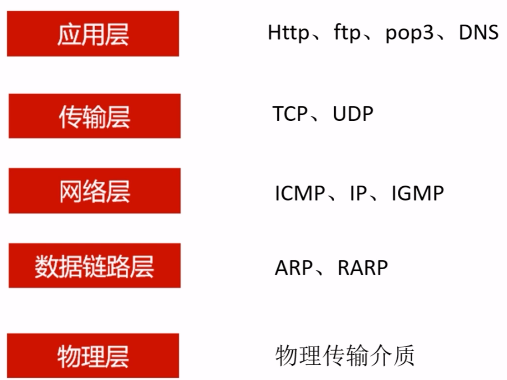
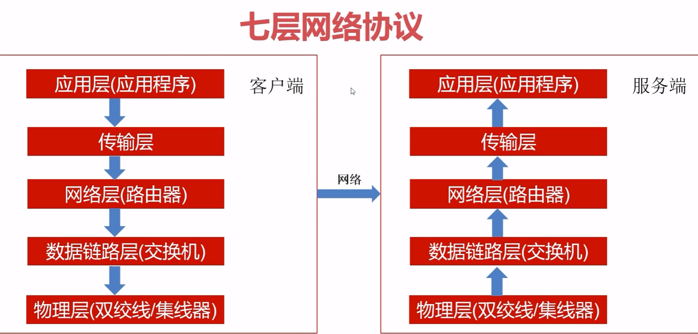
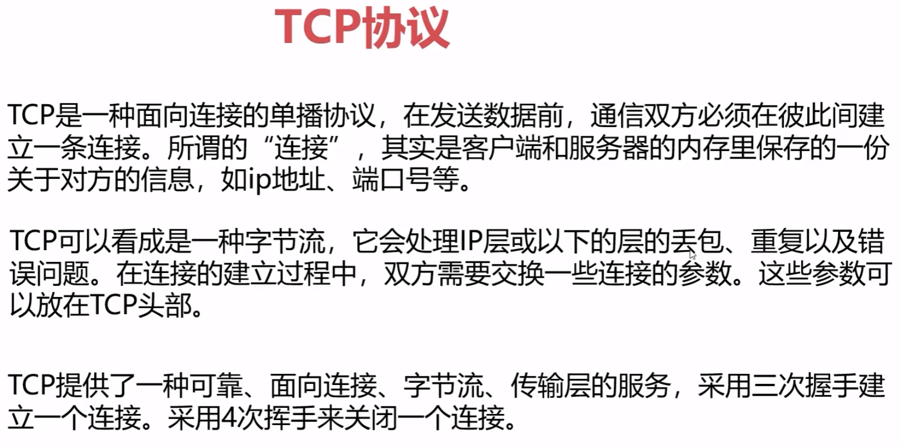
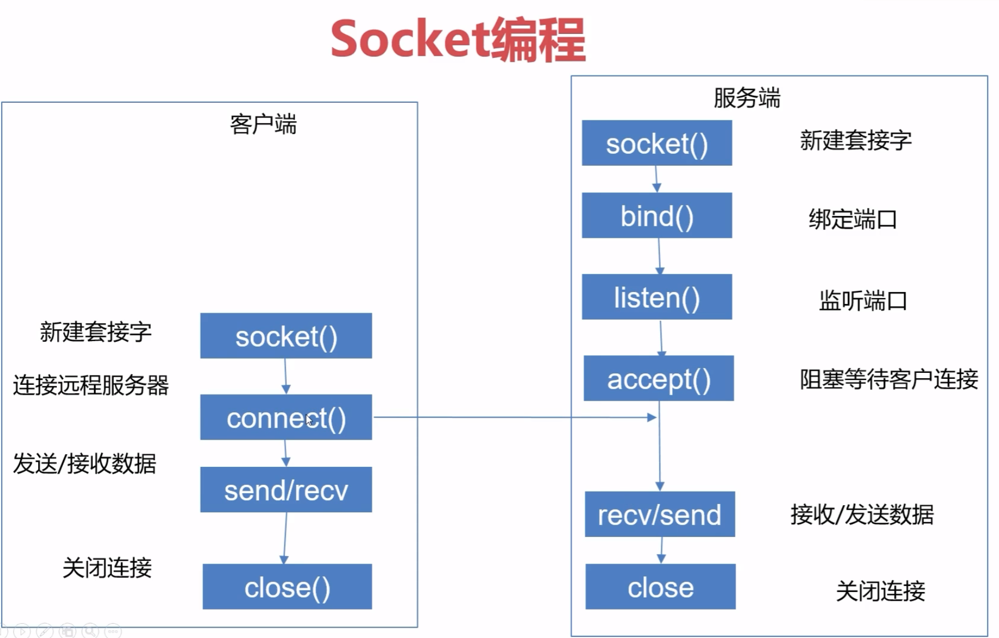

### 爬虫可以做什么

1. 采集网络数据
2. 自动化测试
3. 做一些脱离人手的操作
4. 其他

### 数据能做什么

1. 聚合产品(新闻网站)
2. 搜索引擎
3. 数据分析, 人工智能源数据
4. 特定领域的数据服务(二手车估价, 天气预报, 团购等)

### 学好爬虫需要的知识

1. 计算机网络(http:80/https:443 协议, tcp/ip 协议, socket 编程)
2. 前端基础
3. 正则表达式
4. 数据存储技术(分布式存储)
5. 并发处理技术(多线程,  多进程, 线程池, 协程)
6. 图像识别(处理反爬, 验证码)
7. 机器学习算法(验证码, 数据解析)

### 爬虫中要解决的问题

1. 数据的采集和更新策略
2. 解决反爬
3. 数据解析
4. 数据存储
5. 模拟登录(验证码识别)
6. 爬虫的监控和部署
7. 数据的去重(url去重, 内容去重)

### 如何正确看待爬虫

1. 爬虫不应该毫无节制
2. robots 协议
3. 法律问题
4. 爬虫不能抓到页面上看不到的数据, 是为了防止重复工作
5. 目标网站会有反爬手段

### 学计算机网络的目的

1. 遇到问题懂得分析
2. 模拟登录原理
3. 遇到反爬怎么办
4. 遇到非浏览器的客户端的数据爬取

### IP 地址和 URL

1. ip 地址
    1. 整个网络传输可以比作快递, 数据就是快递包裹
    2. ip 地址就是门牌号
2. 动态 ip 和静态 ip
    1. 格式: xxx.xxx.xxx.xxx, 总长度是 32 位的二进制数字

3. 

### 七层网络协议

1. 应用层, 表示层, 会话层, 传输层, 网络层, 数据链路层, 物理层
2. 常用的五层协议:
    1. 
3. 
4. TCP/IP 协议
    1. ip 地址是逻辑地址, 是 ip 协议提供的一种统一格式的地址
    2. tcp 协议(Transmission Control Protocol)是传输控制协议, 是一种面向连接, 可靠的, 基于字节流的传输层协议, 理解: tcp 把数据拆分成一定长度的"片段", 双端协议
    3. ip 协议用于将多个数据包交换网络连接起来, 它在源地址和目的地之间传输数据包(路由功能)
    4. 

### Socket

1. 应用程序  --> socket --> TCP 协议 (功能类似于插座)
2. 

### Scrapy / Scrapy-Redis
- settings
  - LOG_LEVEL = 'warning'
  - LOG_FILE = 'this.log'
  - scrapy crawl xxxSpider -s CLOSESPIDER_ITEMCOUNT=10
  - scrapy crawl xxxSpider -s CLOSESPIDER_TIMEOUT=10
- 五大核心组件两个中间件
  - Engine
  - Scheduler
  - Spider
  - Downloader
  - Itempipeline
  - Spidermiddlerware
    - process_spider_input(self, response, spider)
    - process_spider_output(self, response, results, spider)
    - process_spider_exception(self, response, exct, spider)
    - process_start_requests(self, start_requests, spider)
  - DownloaderMiddleware
    - process_request(self, request, spider)
    - process_response(self, request, response, spider)
    - process_exception(self, request, exct, spider)
  - 两个中间件都存在方法
    - from_crawler(cls, crawler)
- Important Class
  - scrapy.Request
    - url
    - callback
    - meta
    - headers
    - cookies
    - priority
    - dont_filter
  - scrapy.Response
    - status
    - encoding
    - headers
    - cookies
    - text
    - body[content]
  - scrapy.Spider
    - parse()
    - start_urls -> []
  - scrapy.spider.CrawlSpider
    - start_urls -> [] and rules -> ()
    - scrapy.spider.Rule
      - link_extractor
        - scrapy.linkextractors.LinkExtractor
          - allow
          - deny
          - restrict_xpaths
          - restrict_css
      - callback: str
      - follow: bool

### Mongodb
- Common commands
  - show dbs
  - show collections
  - use database
  - db.createCollection('sw')
  - db.sw.drop()
  - db.dropDatabase()
  - db.sw.insert()|save()
  - db.sw.update(condition{}, data{$set: {}}, upsert, multi)
    - upsert: insert when condition not match data if True, do nothing if False
    - multi: when condition match many data, update all if True else update only one table if False
  - db.remove(condition {})
    - db.user.remove({name: {$regex: 'include'}})
  - db.find(condition {}, keep attr {}).pretty()
    - logical relationship
      - $or, $not, $ne, $lt, $lt[e], $gt[e]
    - regular
      - $regex