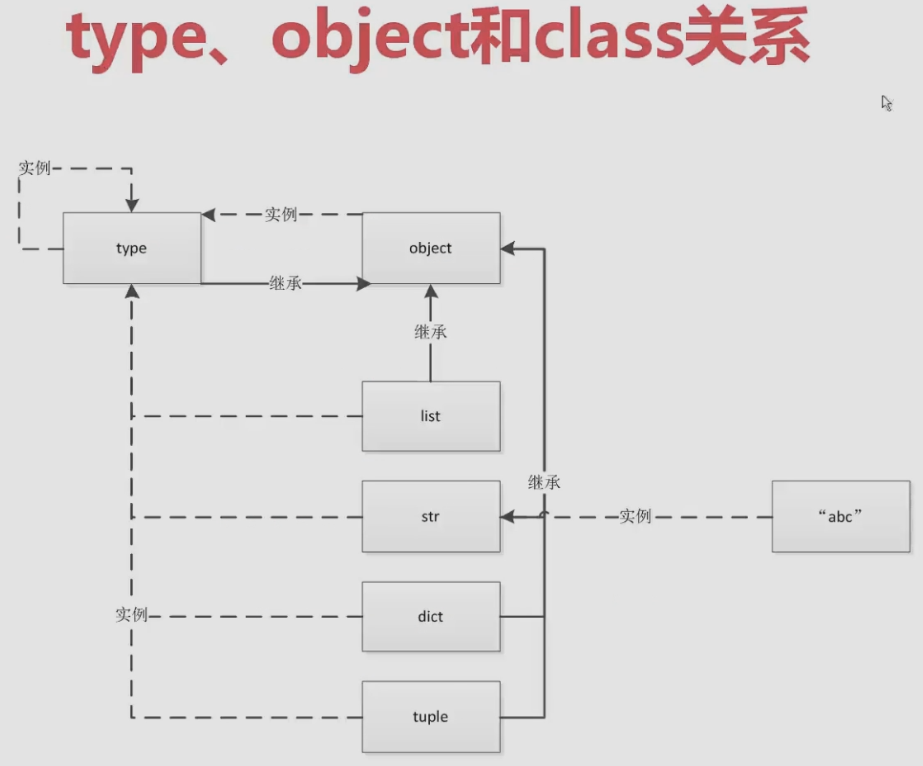

# Chapter 2: Everything is an object in python

### 2.1 Everything is an object in python
```python
class B:
    pass
b = B
```
- Object can assign to a variable
- Object can be add to a set
- Object can be passed as a parameter to a function
- Object can be the return value of a function

### 2.2 The relationship of type, class, object 
```python
type.__bases__ -> (<class 'object'>, )
int.__bases__ -> (<class 'object'>, )
type(object) -> <class 'type'>
```


### 2.3 Common built-in types of python
- Three features of object
  - id, type, value
- None(Unique of global)
- Value
  - int, float, complex, bool
- Iterator
  - use `for` to loop
- Sequence
  - list
  - bytes, bytearray, memoryview
  - range
  - tuple
  - str
  - array
- Map
  - dict
- Set
  - set, frozenset
- Context manager
  - with
- Others
  - module
  - class, instance
  - function
  - method
  - code
  - object
  - type
  - ellipsis
  - notimpletementd