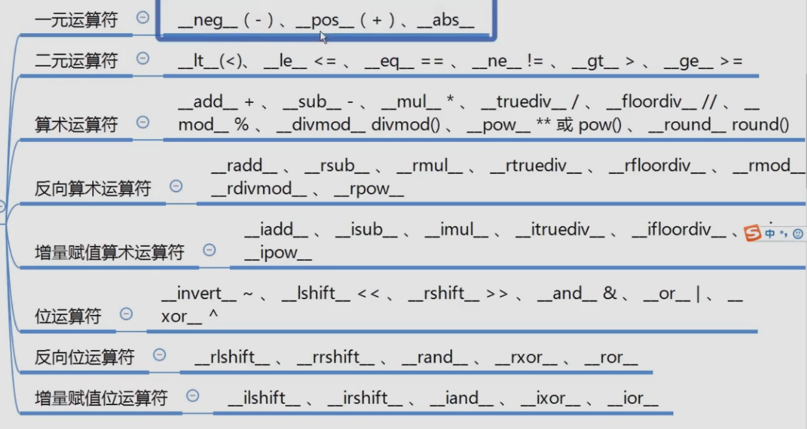

# Chapter 3: Magic function

### 3.1 What is magic function
-  like __func__()

### 3.2 Some magic functions
- str relative
  - `__repr__`, `__str__`
- set, sequence relative
  - `__len__`, `__getitem__`, `__setitem__`, `__delitem__`, `__contains__`
- iterate relative
  - `__iter__`, `__next__`
- callable relative
  - `__call__`
- with relative
  - `__enter__`, `__exit__`
- value relative
  - `__abs__`, `__bool__`, `__int__`, `__float__`, `__hash__`, `__index__`
- meta class relative
  - `__new__`, `__init__`
- attribute realtive
  - `__getattr__`, `__setattr__`
  - `__getattribute__`, `__setattribute__`
  - `__dir__`
- attribute describe relative
  - `__get__`, `__set__`, `__delete__`
- coroutine relative
  - `__await__`, `__aiter__`, `__anext__`, `__aenter__`, `__aexit__`
- math relative
  - 
