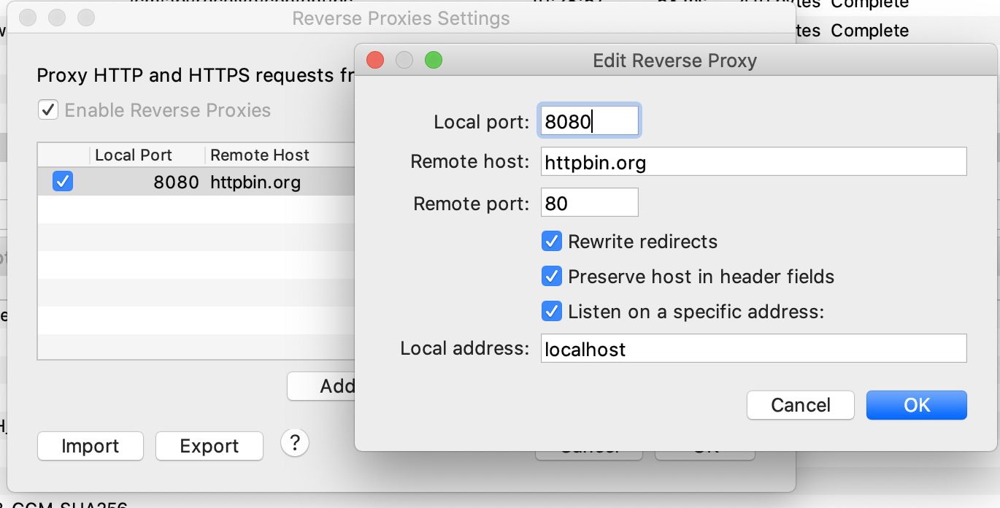

### Install environment of appium
> install appium
  - sudo npm install -g appium
  - sudo npm install -g appium --chromedriver-skip-install
  - pip install appium-python-client
> install appium-doctor [可能不需要]
  - sudo npm install appium-doctor -g
  - brew install carthage
- pip install --pre weditor
- sudo npm install -g anyproxy
  - 设置手机的代理
  - 在手机和电脑上安装证书 127.0.0.1:1082
- 项目目录: npm install redis


```shell
export JAVA_HOME=/Library/Java/JavaVirtualMachines/jdk1.8.0_261.jdk/Contents/Home
export PATH=$JAVA_HOME/bin:$PATH
export CLASS_PATH=$JAVA_HOME/lib

ANDROID_HOME=/Users/ayixi/Documents/Soft/android-sdk-macosx
export ANDROID_HOME
export PATH=$PATH:$ANDROID_HOME/tools:$ANDROID_HOME/platform-tools
```
- 配置完环境变量之后, 如果报错 `the java_home environment variable must be set for android tools to work properly` 需要重启电脑

### adb Command
- adb connect 127.0.0.1:5555
- adb kill-server
- adb start-server   

- adb devices [-l]
- adb [-s 127.0.0.1:62001] install com.douguo....apk
- adb -s emulator-5554 shell
- delete apk
  - adb shell
    - su root
  - cd /data/app/  + ls
  - adb uninstall com.jingdong.app.mall
- adb shell screencap /sdcard/test.png
- adb pull /sdcard/test.png ~/Downloads/test.png
- adb push ~/Downloads/test.png /sdcard/test2.png
- adb -s [xxx] shell
  - logcat | grep cmp= 
  - open apk
  - find "appPackage": "com.tal.kaoyan", "appActivity": "com.tal.kaoyan.ui.activity.SplashActivity"
  - build-tools/29.0.3/aapt dump badging ~/Downloads/com.douguo.recipe_6.9.65.2_544.apk | grep activity
- adb forward tcp:18989 tcp:18989 [建立手机与本地的端口映射]
- adb -s 11a97d54 shell dumpsys activity top | grep [ACTIVITY|mFocusedActivity] [查看当前 activity]
- adb shell dumpsys activity top | grep mFocusedActivity

- python -m uiautomator2 init
- python -m weditor

### [Charles Settings](https://www.jianshu.com/p/73b134559c76)
- 
- map local/remote, 把网页内容映射到本地/远程
- [Charles抓https显示unknown解决方法](https://zhuanlan.zhihu.com/p/35498250)

### Mitmproxy
- pip install mitmproxy
- SwitchyOmega:http 192.168.80.156[127.0.0.1] 8080
- mitm.it -> install certificate
- z: clear flows
- f: 
  - !(~c 200) -> not 200 request
  - ~d baidu.com
  - ~m post & ~u baidu.com

### Android SDK
- software development kit
  - 软件开发工具包, 是软件开发工程师用于特定的软件包, 软件框架, 硬件平台, 操作系统等建立应用软件的开发工具的集合
- [下载地址](http://sdk.android-studio.org/)
- open SDK Manager (android-sdk-macosx/tools/android) 需要 jdk 1.8 (百度网盘)
- Android SDK Manager Proxy:
  - mirrors.neusoft.edu.cn:80
  - 
- Download:
  - platform-tools
  - tools
  - build-tools
  - extra > all
  - some apis

### Package
- pip install uiautomator2
- pip install -U facebook-wda

### RUN 
- adb devices 确认连接上
  - 核对代码中的 desc
- appium
- anyproxy --rule /Users/ayixi/Documents/Code/wechat/wechatest.js -i
  - 手机设置代理 192.168.80.182 8001
  - 下载证书
- 


## adb debugger
- [Android修改ro.debuggable 华为真机adb调试所有进程](https://www.renyiwei.com/archives/1704.html)
- [mprop](https://github.com/wpvsyou/mprop)
- [JustTrustMe](https://github.com/Fuzion24/JustTrustMe)