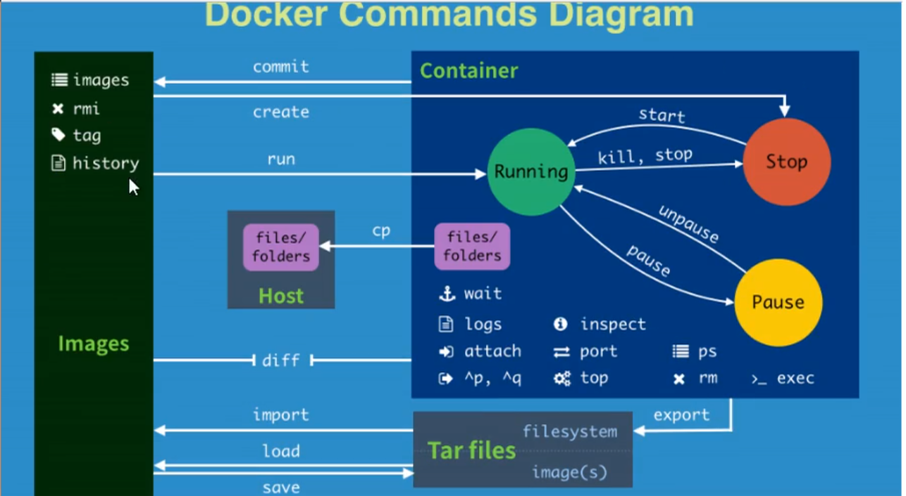
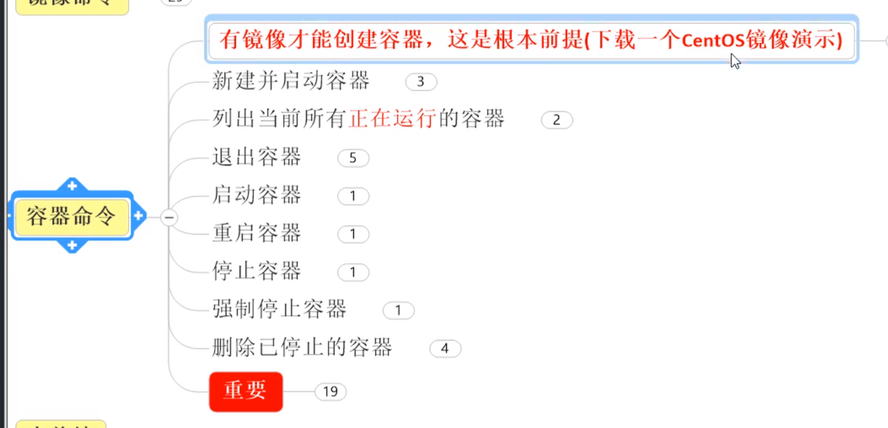

>## Based on Go-lang, Open Source
>## Build, Ship and Run Any App, Anywhere
>## Three Elements: Repository, Image, Container 

## Environment
- Linux ubuntu 4.15.0-52-generic
- apt install docker.io
- yum -y install docker.io

## Config File
- etc/default/docker

## Execute file
- /usr/bin/docker

## Restart
- service docker start
- service docker restart
- docker version

- systemctl daemon-reload
- systemctl restart docker

## Change aliyun mirror
- 容器镜像服务 > 镜像中心 > 镜像加速器
- vim /etc/docker/daemon.json
- add `{"registry-mirrors": ["https://o01kk3qg.mirror.aliyuncs.com"]}`
- restart

## Check Commands
- docker info / --help / version
- ps -ef | grep docker [check mirror]

## Docker ps
- docker ps  `active container`
- docker ps -a          `all`
- docker ps -aq          `all container id`
- docker ps -n 5        `recent 5 containers`
- docker ps -l          `display latest contains`
- docker ps -lq         `only display latest container id`

## Docker run
- docker run [-it] hello-world [/bin/bash]
- docker run [-d] hello-world  
- docker run -d centos /bin/sh -c "while true; do echo 1; sleep 2; done"   
- docker run -it -p 8888:8080 tomcat
- docker run -d -p 8889:8080 tomcat
- docker run -it -P tomcat
- docker run -v /my_volume:/container_volume <id>
- docker run -v /my_volume:/container_volume:ro <id>

- docker run -it --name dc01 b003a5dbf649 
- docker run -it --name dc02 --volumes-from dc01 b003a5dbf649   `data volume would delete when no container reference it`
 
## Docker logs
- docker logs [-ft] <id> `t=time, f=fresh`

## Docker rm
- docker rmi -f python
- docker rmi -f $(docker images -aq) == docker ps -aq | xargs docker rm  `delete image`
- docker rm -f $(docker ps -q) `delete all running containers`
- docker stop/restart/kill
- docker rmi $(docker images | grep "none" | awk '{print $3}')  `delete "none" image`

## Docker container
- docker container ls 
- docker container ls -a
- docker [container] restart <id>
- docker [container] start -i <id>
- docker [container] stop <id>
- docker container prune `delete all stop containers`

- docker top <id>
- docker inspect <id>
- docker attach <id>
- docker exec [-t] <id> ls -l /root/ 
- docker exec [-it] <id> /bin/bash

- docker cp 3f8689643bcd:/tmp/yum.log /root/new_yum.log

## Export / Import
- docker export <id> > ubuntu.tar
- docker import <id> ubuntu.tar

## Docker push
- docker commit -a="ayixi" -m="del doc" 6e814ccf393a ayixi/tomcat:1.09.1
- docker tag f54381105468 ayixi/mydockertest:latest
- docker login
- docker push ayixi/mydockertest:latest

## Dockerfile
- [Reversed Word]
  - FROM        `*inherited who*`
  - MAINTAINER  `author information`
  - RUN         `run a command / shell`
  - EXPOSE      `expose port`
  - WORKDIR     `workdir`
  - ENV         `add environment path`
  - ADD         `copy and unzip`
  - COPY        `copy`
  - VOLUME      `add volume`
  - CMD         `cover command`
  - ENTRYPOINT  `append params`
  - ONBUILD     `triggered when inherited`

- docker build -f Dockerfile -t ayixi2/centos .  `$1`
- docker build -f Dockerfile2 -t mycentos:1.2 .
- docker build -t mycentos:1.3 .
- docker history <id>

## Practice
- docker run -p 3307:3306 --name mysql -v /root/dockerfiles/mysql/conf:/etc/mysql/conf.d -v /root/dockerfiles/mysql/logs:/logs -v /root/dockerfiles/mysql/data:/var/lib/mysql -e MYSQL_ROOT_PASSWORD=82134 -d mysql
- docker exec mysql sh -c 'exec mysqldump --all-databases -uroot -p"xxxxx"' > /root/dockerfiles/mysql/all_databases.sql

- docker run -p 6379:6379 -v /root/dockerfiles/redis/data:/data -v /root/dockerfiles/redis/conf/redis.conf:/usr/local/etc/redis/redis.conf --name redis -d redis redis-server /usr/local/etc/redis/redis.conf --appendonly yes

---

---

