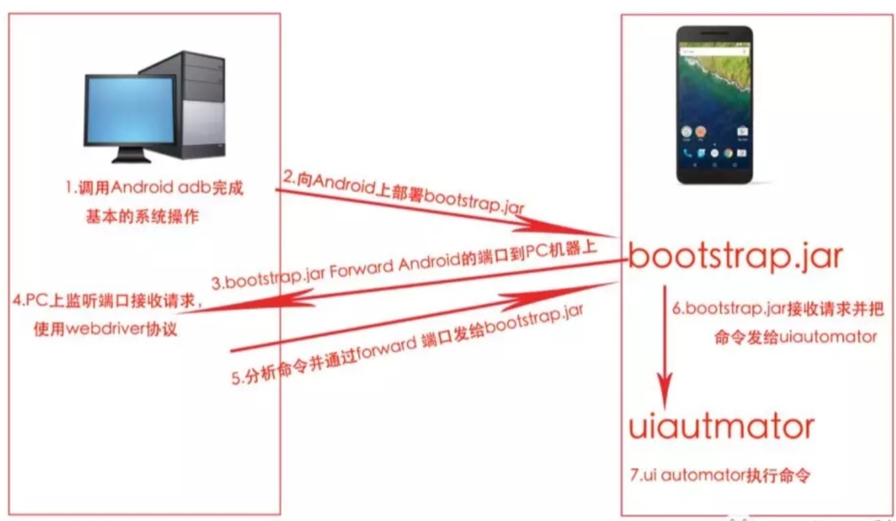

- 闭包是什么?
  - python中闭包从表现形式上看, 如果在一个内部函数里, 对在外部作用域（但不是在全局作用域）的变量进行引用, 那么内部函数就被认为是闭包(closure)
- 生成器和迭代器?
  - 使用了 yield 的函数被称为生成器
  - 可迭代对象是迭代器, 如 list, set
  - 把一个类作为一个迭代器使用需要在类中实现两个方法 `__iter__()` 与 `__next__()`
- 协程?
  - 伪多线程
  - 协程的开销远远小于线程的开销
  - 协程不是被操作系统内核所管理, 而完全是由程序所控制(也就是在用户态执行), 这样带来的好处就是性能得到了很大的提升
  - 协程的应用场景主要在于: I/O 密集型任务
  - 简单来讲协程的好处: 
    - 跨平台
    - 跨体系架构
    - 无需线程上下文切换的开销
    - 无需原子操作锁定及同步的开销
    - 方便切换控制流, 简化编程模型
    - 高并发+高扩展性+低成本: 一个CPU支持上万的协程都不是问题。所以很适合用于高并发处理。
  - 缺点:
    - 无法利用多核资源
    - 协程的本质是个单线程,它不能同时将 单个CPU 的多个核用上,协程需要和进程配合才能运行在多CPU上.当然我们日常所编写的绝大部分应用都没有这个必要, 除非是cpu密集型应用
    - 进行阻塞（Blocking）操作（如IO时）会阻塞掉整个程序: 这一点和事件驱动一样, 可以使用异步IO操作来解决
- [Scrapy](https://blog.csdn.net/liurwei/article/details/81461222)
  - Engine
  - Schedule
  - Spider
  - Downloader
  - SpiderMiddleware
  - DownloadMiddleware
  - SchedulerMiddleware
- Mysql
  - [MySQL索引原理及慢查询优化](https://tech.meituan.com/2014/06/30/mysql-index.html)
    - 建立索引
      - 联合索引
      - 最左前缀匹配(因为 B+ 树数据结构的原因, Mysql 索引是一层一层匹配的, 所以最容易判断的条件应该在最前面, 最先筛查)
  - [查询优化](https://dbaplus.cn/news-155-1531-1.html)
    - Scheme设计与数据类型优化
    - 数据类型越小越简单越好
    - 创建高性能索引
      - 前缀索引
      - 多列索引和索引顺序
      - 定期删除长期未使用的索引  
    - 避免多个范围条件(无法同时使用多个索引)
    - 优化COUNT()查询
    - 优化关联查询
    - 优化LIMIT分页
    - 优化UNION
- 为什么有 GIL 还要保证线程安全?
  - 非原子的操作不是线程安全的
    - list[0] += 1 : 不是原子操作
- [既然有 GIL(Global Interpreter Lock) 为什么还能多线程/多进程](https://zhuanlan.zhihu.com/p/20953544)
  - GIL 是针对每个进程而言, 而在多核 CPU 中, 是可以同时并行多个进程, 这样就能实现多进程. 但是对于每个 CPU 的单核心, 进程确实由于 GIL 的限制一时间只能同时执行一个
  - 对于进程中的线程确实是受到 GIL 限制的, 在 Python 多线程下, 每个线程的执行方式是: 1. 获取 GIL. 2. 等待程序执行到 sleep 或者 python 虚拟机将其挂起. 3. 释放 GIL, 导致效率不是很高
  - 对于 CPU 密集型任务, 多个线程切换会造成更多的资源消耗; 而在 IO 密集型任务中, 多线程中 IO 等待时间相对较多, 切换多线程就节约 CPU 资源, 所以多线程对 IO 密集型任务更加友好
  - python 由于 GIL 的存在, 更适合用多进程而不是多线程
- [redis 中获取相应 score 的命令(sorted set)](https://www.runoob.com/redis/redis-sorted-sets.html)
  - zadd name 1 value
  - zscore myzset name
  - zrange name 0 10 withscores
- [闭包应用场景](https://www.jianshu.com/p/418440af6baf)
  - 每个嵌套在内部的函数都有 `__closure__` 属性
  - 闭包使得函数内部的局部变量可以在全局访问
  - 装饰器就是一个闭包的应用场景
- [线程协程区别, 应用场景](https://blog.csdn.net/weixin_44321942/article/details/89154344)
  - 协程是一种用户态的轻量级线程, 调度由用户(代码?)控制, 直接操作栈基本没有内核开销
  - 协程多与线程进行比较
    - 一个线程可以多个协程, 一个进程也可以单独拥有多个协程, 这样python中则能使用多核CPU。
    - 线程进程都是同步机制, 而协程则是异步
    - 协程能保留上一次调用时的状态, 每次过程重入时, 就相当于进入上一次调用的状态(yield)
    - IO密集型一般使用多线程或者多进程, CPU密集型一般使用多进程, 强调非阻塞异步并发的一般都是使用协程, 有时候也是需要多进程线程池结合的
- [js 逆向, hook](https://aijishu.com/a/1060000000008637)
    - 钩子机制, 快速**匹配**到想要的变量的生成方式, 如 cookie 等
    - 通过油猴插件就可以执行使用
    - 配合 fiddler 重定向功能能找到混淆之后的变量生成方式
- [fiddler 证书原理](https://zhuanlan.zhihu.com/p/25591288)
  - 浏览器的请求现转发给 fiddler`此时fiddler相当于服务器(也就是代理服务器)`, 此时的证书是 fiddler 自己颁发的, 所以需要用户手动添加信任, 这样浏览器就不会报证书错误
  - 然后 fiddler `此时相当于浏览器` 请求知乎, 由于知乎有证书, 所以不会报错, 正常返回给 fiddler, 然后由 fiddler 返回给浏览器进行展示
  - 浏览器拿到 fiddler 给的公钥，私钥在 fiddler 那里，所以 fiddler 可以解密浏览器原本发往知乎服务器的数据
- [appium 实现原理](https://zhuanlan.zhihu.com/p/67954934)
  - selenium 将浏览器原生的 API 封装成 WebDriver API, webdriver 是基于 http协议的, appium 是基于 webdriver 协议添加对移动设备自动化api扩展而成的，基于tcp/ip协议(使用 socket 接口)
  - appium 接收 python, java 等测试脚本, 然后通过 appium client 转换为 json 格式传递给 appium server, 其监听一个端口如 8000, 同时向手机端 adb(android debug bridge) push 一个 bootstrap.jar/bootstrap.js 的脚本, 手机端通过该脚本同时监听端口 8000, 此时 PC 和手机端就通过这个端口实现了通信和交互，基于 socket 通信(一个封装了 TCP/IP 协议的接口), 然后手机端通过该端口传输的命令执行 APP，bootstrap里面封装了安卓和苹果的自动化测试框架 UIautomator(低版本的安卓是instrumentation) 执行的相应命令, 执行完操作后通过端口返回给 PC 端，PC 端根据返回结果 json 做校验，同时也知道了操作是否执行成功, 由此一次交互就算完成
  - 

