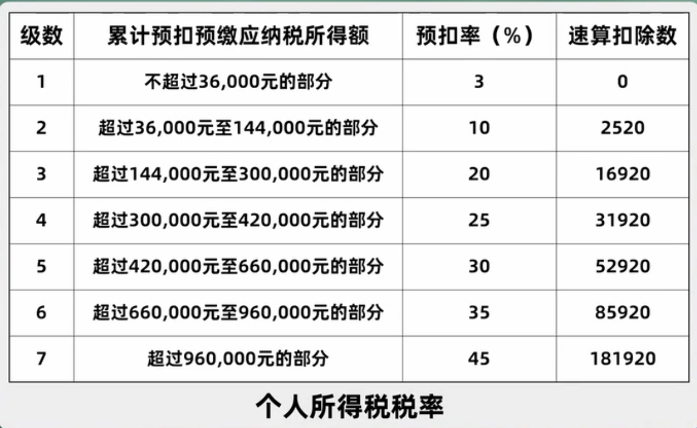

# 个人所得税
1. 应纳税所得额
   - (+) 综合所得额
     - 工资
     - 劳务 * 0.8 (eg. 兼职; 程序员工作之外做的软件收入)
     - 稿酬 * 0.8 * 0.7
     - 特许使用费 * 0.8
   - (+) 其他
     - 经营所得
     - 利息股息红利
     - 财产租赁所得
     - 财产转让所得
     - 偶然所得
   - (-) 免征
     - 60K
   - (-) 扣除
     - 专项 (三险一金)
     - 附加 
       - 子女教育, 12K/人/年
       - 继续教育 (4.8K, 3.6K)
       - 大病医疗 (80K)
       - 房贷 (12K)
       - 房租 (18K, 13.2K, 9.6K)
       - 赡养老人 (24K)
2. 所得税计算
   - 