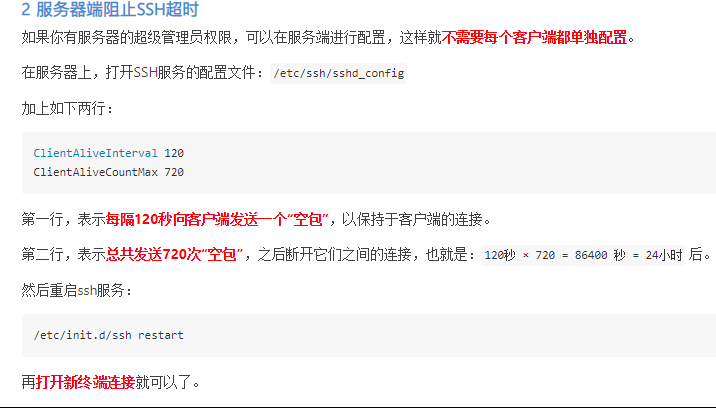

### 登录ECS云服务器

```shell
login：root
password：实例密码，可以自己设置
远程登录： ssh root@39.105.37.123
  	                  NIANshao1
```


### 安装pip3

```shell
apt upgrade
apt install python3-pip
```


### VIM 显示行号

```shell
vim ~/.vimrc
set number
```


### 美化终端教程

```shell
https://sspai.com/post/45332
```


### 重新连接

```shell
# 删除之前的信息 
ssh-keygen -R 39.105.37.123
```


### 设置永久环境变量(windows)

```shell
setx mypc "ssh root@39.105.37.123"
远程登录： %mypc%
```


### 上传文件/下载文件

```shell
scp a.txt root@39.105.37.123:~
scp -r Patent\ root@39.105.37.123:~ 

scp root@39.105.37.123:/var/www/test.txt
```


### SSH连接超时

```shell
vim /etc/ssh/ssh_config
TCPKeepAlive yes
```




### 生成/安装 requirements.txt(需要虚拟环境)

```shell
pip freeze > requirements.txt
pip install -r requirements.txt
```


### 定时任务 crontab

```shell
crontab -l  显示定时任务
crontab -e 编辑定时任务
vim /etc/crontab 编辑全局定时任务
service cron restart/start/stop

# 执行每日邮件:
nohup python3 /root/Patent/send_mail_to_songjiajia.py >> /root/email.txt &
```


### SSH

```shell
把 C:\Program Files\Git\usr\bin 添加到path环境变量, 就能使用ssh和scp了
```


### 快捷方式

```shell
vim ~/.bashrc

alias pycharm="bash xx/xx"

source ~/.bashrc
```


### 虚拟环境设置

```shell
vim ~/.bashrc

export VIRTUALENVWRAPPER_PYTHON=/usr/bin/python3.6
export WORKON_HOME=$HOME/envs
source /usr/local/bin/virtualenvwrapper.sh

source ~/.bashrc
```


- 查看文件大小
	- `du`
	- `du -sh /root`
	- `do -h --max-depth=1 /root`
