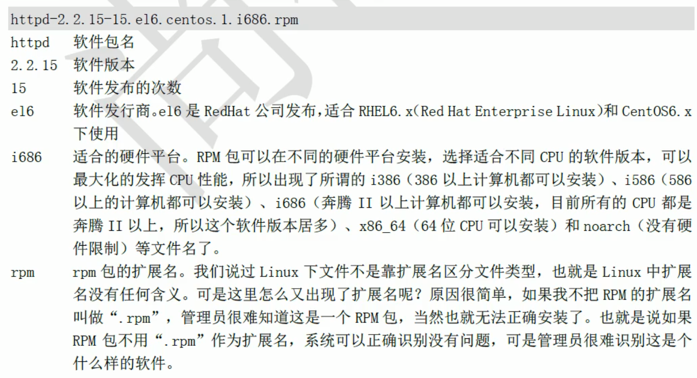
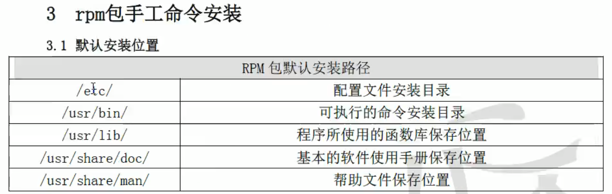

# Draft file

- linux 可以不加扩展名, 扩展名都是为了区分
- sync --> shutdown -r now
- IP, mac addr, port, protocol, data of data package

有文件上级目录的写权限才能删除文件

对文件而言最大权限是x, 对目录而言最大权限是w, 目录的x表示可以cd

目录: 0 5 7 
文件: 0 4 6 

umask 默认权限
/etc/profile 环境变量配置文件
whatis uname == man -f uname 
info ls
vim --> n N g G /? 
type ls
help cd

search commands:
whereis 
which
locate dir:/var/lib/mlocate/mlocate.db 
    yum install -y mlocate 
    updatedb
    `vim /etc/updatedb.conf [db conf]`

find
    -a   and
    -o   or
    -not==! not

    find . -name abc
    find . -iname abc
    find . -size +2.1G
    find . [-atime|-mtime|-ctime]
        -atime 文件访问时间
        -mtime 文件数据修改时间
        -ctime 文件状态修改时间 
    find . -perm +444
    find . -type [f|d]
    find . -size +1k -a -type f
    find . -size +1M -a -type f -exec ls -lh {} \;
    find /var/log -mtime +300 -exec ls -lh {} \;

- soft link must be `absolute path`
- ln -s file link
- cp -r [copy dir]
  
- write >> send message to another user
- wall >> send message to other users
- w >> logged in user
- sync
- shutdown -r now

- driver: `/lib/modules/3.10.0-862.14.4.el7.x86_64/kernel`

## Vim
  - a
  - A
  - i
  - I
  - o
  - O
  - gg
  - G
  - :n
  - hjkl
  - ^
  - $
  - s, 10s
  - x, nx
  - dd, ndd, :n1,n2d
  - yy, nyy, :n1,n2y
  - p, P
  - u, ctrl + y
  - /xx, n, N
  - 1,10s/old/new/g, %s/old/new/g, /1,10s/^/#/g
  - :r /root/1.txt
  - vim -0 a.txt b.txt
  - vim -O a.txt b.txt

## software installation
- source package [.tar.gz]
- binary package [.rpm] [.dpkg]
- `/var/lib/rpm` >> system db 
- rpm -ivh xxx.rpm >> install dependencies is complicated
- yum
- apache -> httpd-2.2.15-15.e16.centos.1.i686.rpm
  - apache process named httpd 
  - 
- default installation position
  - `/etc/`
  - `/usr/bin/`
  - `/usr/lib/`
  - `/usr/share/doc/`
  - `/usr/share/man/`
  - 
- service [/etc/init.d/]
- rpm
  - rpm pkg use default installation directory
  - source pgk point installation directory
  - rpm -qf /bin/ls
  - rpm -q[ail] python
  - rpm2cpio /xx/httpdxxx.rpm | cpio -idv ./etc/httpd/conf/httpd.conf
  - Digital certificate import
    - rpm --import /etc/pki/rpm-gpg/RPM-GPG-KEY-CentOS-6
    - rpm -qa | grep gpg-pubkey