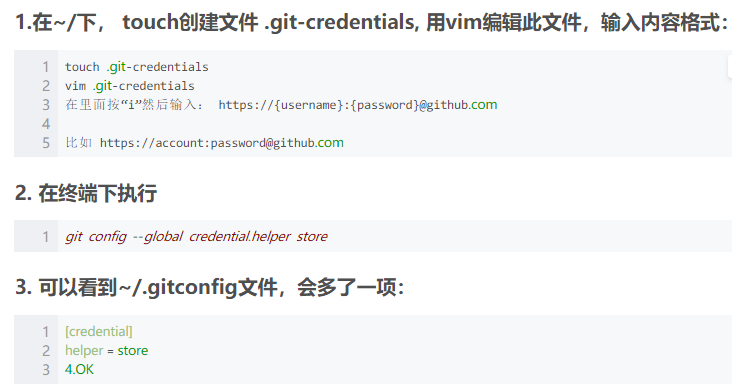

### 先设置git, github永久存储密码 [详情](https://blog.csdn.net/zhangxiaoyang0/article/details/69239734)




### 合并本地文件

```shell
git commit -m "" __init__.py
git push

git fetch --all 
git reset --hard origin/master
git pull
```

