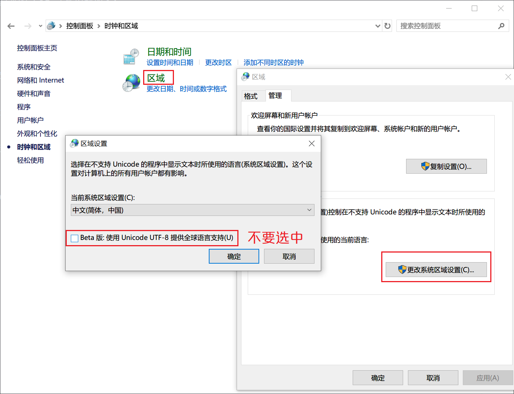
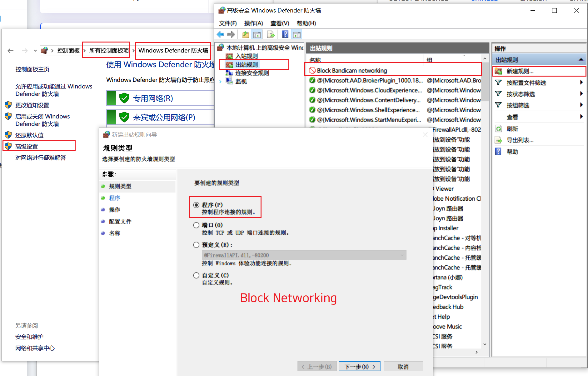

## Language garbled

## Block networking

## Linux subsystem default root
- ubuntu1804.exe config --default-user root

## Display windows tile
- [WIN+R] %localappdata%
- [DELETE] Iconcache.db
- [RESTART] Windows Explorer

### 设置永久环境变量(windows)
- administrator run `cmd` not powershell
- setx /m "PYTHONPATH" "%PYTHONPATH%;D:\Files\Code\SourceCode" (永久添加环境变量, 结尾不能是 `SourceCode\`, `\` 会被转义)
  - setx [forever]
  - /m [system]
