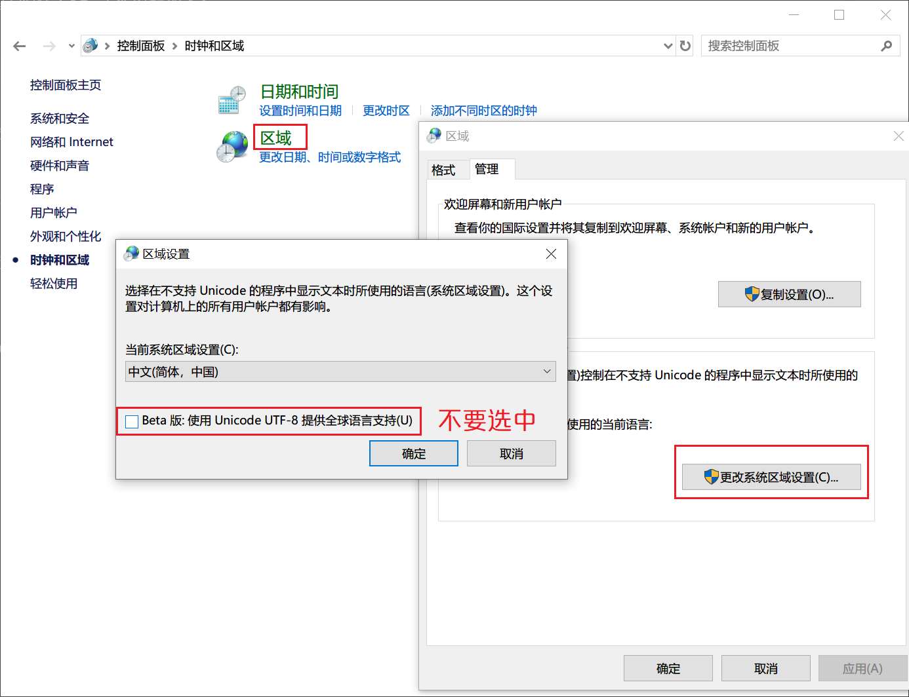

## Language garbled

## Block networking

## Soft
- 微PE
- 傲梅分区助手(不需要格式化无损修改分区容量)
- Ocam(录屏, 简洁)
- JJDown(下载B站视频)
- 百分浏览器
- 

## Linux subsystem default root
- ubuntu1804.exe config --default-user root

## Display windows tile
- [WIN+R] %localappdata%
- [DELETE] Iconcache.db
- [RESTART] Windows Explorer

### 设置永久环境变量(windows)
- administrator run `cmd` not powershell
- setx /m "PYTHONPATH" "%PYTHONPATH%;D:\Files\Code\SourceCode" (永久添加环境变量, 结尾不能是 `SourceCode\`, `\` 会被转义)
  - setx [forever]
  - /m [system]

### Windows download system soft
- [Download](https://docs.microsoft.com/zh-cn/sysinternals/downloads/)

### Network checking
- netstat -aon | findstr "1080"
  -  TCP  127.0.0.1:1081  0.0.0.0:0 LISTENING  20336
- tasklist | findstr "20336"
- taskkill /F /PID 20336
- taskkill /F /im firefox.exe  [kill all firefox process]