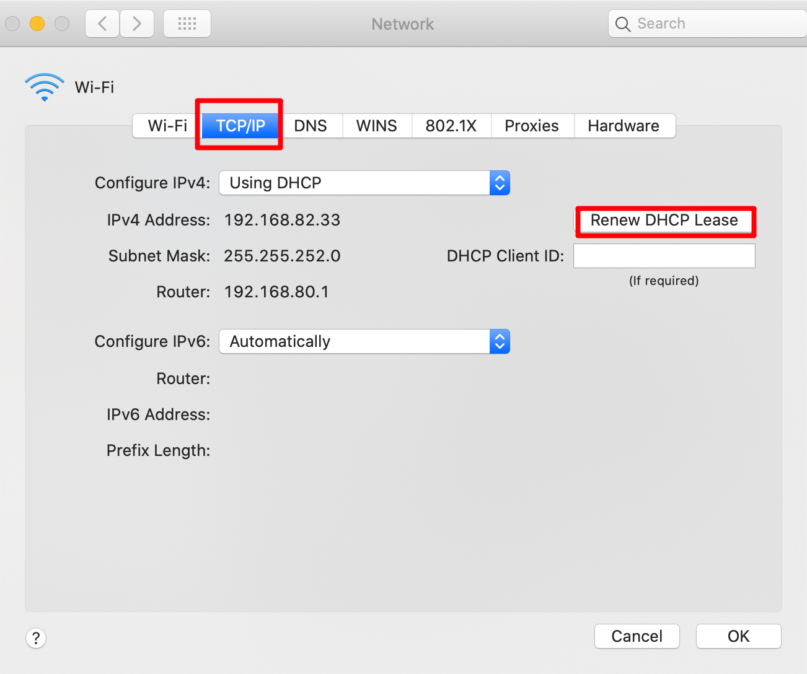

### *2020-10-11*
- [REALI]
  - 检查各项任务的运行情况
  - 开发微信项目
    - 对返回和某些错误进行处理
    - 查看研究通过接口访问数据
- [LEARN]
  - 阅读 Anyproxy 官方文档, 对其中代码进行调试
  - 了解微信逆向
    - 用另一个 app hook 微信, 可以实现批量关注, 批量取消关注等, 当文章推送时被 hook 到, 自动发送到服务器

### *2020-10-12*
- [REALI]
  - 重启 Youtube 视频下载程序
    - 查看日志寻找程序中断的原因
      - 可能是链接数据库报错
      - nohup 后台运行 print 内容无法打印, 使用 logger 或者 sys.stdout.write()
  - 增加 Youtube 视频下载程序的错误检测
  - 更新 howtogeek 剩余需要更新的文章
  - 与刘静讨论处理外文站点的相关问题
    - 总结哪些站点遇到了错误
    - ...
- [LEARN]
  - git reset 9c87123 --hard
    - git push --force
    - Gitlab:You are not allowed to force push code to a protected branch on this project.
    - 不能通过强制 push, 正常情况下是可以的
  - python -m venv venv

### *2020-10-13*
- [REALI]
  - 更新 bilibili 个人用户的视频
  - 对 medium 站点文章下载失败问题的排查
    - 需要更新 chromedriver 到符合 chrome 的版本
  - 给刘静调试 VPN
  - 完成 `hanselman` 外文博客第一版
  - 审核个人博客搬家问题
  - [wechat 项目 nodejs 操作 mysql](https://www.yiibai.com/mysql/nodejs-insert.html)
- [LEARN]
  - nodejs
    - 单线程
    - 非阻塞 I/O
    - 事件环

### *2020-10-14*
- [REALI]
  - 给 Youtube 视频信息添加搜索关键词
    - ON DUPLICATE KEY UPDATE keyword=values(keyword)  : 更新 keyword
    - ON DUPLICATE KEY UPDATE keyword=keyword          : 不更新 keyword
    - 对 SSLError, ProxyError 的处理
  - 修复 `hanselman` 外文博客
  - 完成 `poftut` 外文博客第一版
  - 写微信的 JS 项目
- [LEARN]
  - NodeJs
    - 回调
    - 对数组, 字符串的处理
    - 对网页转义的处理
    - trim(), redis, mysql

### *2020-10-15*
- [REALI]
  - 修复 mysql 多线程冲突的问题
    - pymysql.err.InterfaceError
    - 每个线程独自实例化一个 mysql 对象才行, 多个线程同时调用 cursor.execute() 和 cursor.commit() 会可能会冲突
    - 重新更新 youtube 视频下载
  - 基本重构完成 wechat 项目并且合并到 move_blog_spider
    - 通过 redis 交互来找到新增的 wechat 爬虫
    - mysql 数据库编码问题, 无法解决, 最终是通过 js 去掉标题的 emoji
  - 完成 `qq_41553240` 用户的个人博客搬家(94)
- [LEARN]
  - js 异步函数的编写, Promise 的学习
  - [redis 集合的操作](https://www.runoob.com/w3cnote/python-redis-intro.html)

### *2020-10-16*
- [REALI]
  - 在 MacMini 上面配置微信脚本运行环境
    - 更新 [appium.md](../../Code/Lang/Python/appium.md)
  - 阅读 wechat_appium 源码, 实现微信历史文章抓取全部逻辑
  - 对数个不方便统计文章的外文站点进行文章统计
  - 完成 `whatiscode` 用户的个人博客搬家(25)
  - 完成 `f1520107395` 用户的个人博客搬家(81)
  - 完成 `z124665532` 用户的个人博客搬家(29)
  - 配置 Vscode
    - 转移编写代码到 Vscode
  - 完成周报
- [LEARN]
  - 重新熟悉了一遍 Appium 的环境的安装
    - 可能需要重启

### *2020-10-19*
- [REALI]
  - 外文翻译项目停了
  - 内网 ip 冲突: 192.168.80.255  255 结尾 访问不通
  - 
  - 微信更新文章 5 个账号
  - 突然发现抖音的接口, 并且可用, 稳定性还需要测试
- [LEARN]
  - 查看 root 文章, 还是没看懂
  - 学习 BloomFilter
    - 哈希次数
    - 数组长度
    - 容错率由上面两者共同决定

### *2020-10-20*
- [REALI]
  - 更新 youtube 需要下载的视频 url
  - 测试抖音单个视频下载
    - 解析 JSON, 查看各个字段
  - 安装使用 apktool, dex2jar 等逆向软件
  - 个人博客审核
- 排查查视频上传出问题的原因
- [LEARN]
  - 学习 ssl-pinning 技术
  - [学习安卓逆向](../../Code/Lang/Python/Crawler/Android%20Reverse/reverse.md)
  - logging.basicConfig(level=logging.DEBUG, filename='video.log')

### *2020-10-21*
- [REALI]
  - 多线程上传视频, 测试转码失败的原因
    - 对比多线程单线程传视频的成功率
    - 单线程 20 成功 20
    - 多线程 20 成功 17
    - 初步怀疑是这里的原因
  - 完成 `weixin_43017921` 用户的个人博客搬家(23)
  - mac 键盘替换的重新设置
  - 完成 `ayuayue` 用户的个人博客搬家(90)
  - 完成 `Zzzpiu` 用户的个人博客搬家(38)
  - 完成 `liujh1992326` 用户的个人博客搬家(10)
  - 完成 `zhuanglicheng` 用户的个人博客搬家(172)
  - 更新 1 个微信用户的公众号历史文章
  - 更改 `youtube` 视频下载为单线程模式
  - 对错误上传到阿里云视频的调试
- [LEARN]
  - Vscode 复制正则表达式 `⌥ + enter`

### *2020-10-22*
- [REALI]
  - 对用户数据库的探讨设计
  - 对抖音的 apk hook 解决方案进行调试, 结果是不行
  - 完成第一个安卓 apk 的逆向
  - [了解安卓软件破解的方法](https://bbs.nightteam.cn/thread-428.htm)
- [LEARN]
  - 安卓逆向

### *2020-10-23*
- [REALI]
  - 完成 `JonasErosonAtsea` 用户的个人博客搬家(132)
  - 完成 `qq_38499671` 用户的个人博客搬家(252)
  - Youtube 视频搬家代理到期, 更改昨晚下载错误的状态码到 0
  - 更新 Youtube 视频搬家代理设置和日志设置等信息
  - 获得软件 Bcompare, 存入百度云
  - 研究抖音抓取视频的算法
  - [安装 Mongodb](https://www.runoob.com/mongodb/mongodb-osx-install.html) 并添加 Mongodb 到百度云
- [LEARN]
  - 抖音纯代码逆向

### *2020-10-24*
- [REALI]
  - 完成第一个 Android `Hello World` 程序
- [LEARN]
  - Android 布局, 开发 
    - OnCreate()
    - OnResume()
    - ...
  - [Frida Hook App](https://www.youtube.com/watch?v=XwqEaJWpMno)
  - [Frida JAVA API 文档](https://www.jianshu.com/p/5ef0e4e2788a)
  - 了解 Spark Local 流程

### *2020-10-25*
- [REALI]
  - [完成 NodeJs 微信支付流程的开发](https://github.com/AYiXi/Pay-app-final)
- [LEARN]
  - [JS库](https://www.jsdelivr.com/)
  - NodeJs
  - shell 脚本自动部署
  - Nginx 反向代理
  - HTTPS 的申请流程