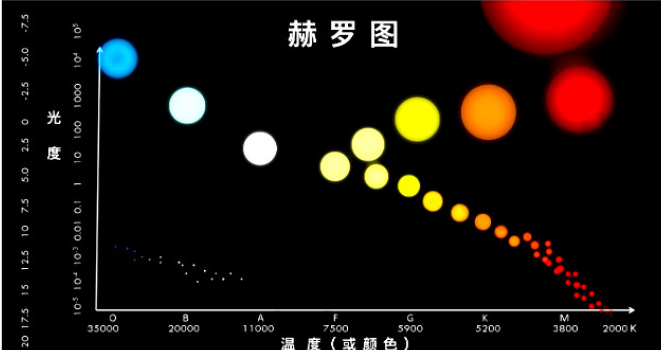

# 天文学通识课

### 宇宙学原理, 天文学的第一定理

> 地球不特殊, 地球上的规律在其他地方也使用

###  光谱分析, 宇宙学原理的实证

> 光谱分析是天文学里的显微镜, 能知道上亿光年距离的天体的元素构成
>
> 天文学家在恒星和其他天体上面验证了宇宙学原理
>
> 宇宙膨胀会导致光谱红移, 需消除误差才能知道元素构成, 也是有效的测距手段

### 距离测量, 宇宙学原理的推进器

> 高度, 视觉大小, 红移程度等很多参数会受距离影响, 把距离因素消除后才满足宇宙学原理
>
> 天文学测量距离方法多种, 由近到远用 `恒星视差法`, `标准烛光法`, `红移测距`

### 模型体系, 天文学的核心框架

> 天文学不能像其他学科那样反复实验, 只能依赖有限的观测数据, 所以必须通过模型的猜测推动理论前行
>
> 天文学需要将模型尽可能多的联系起来才更可靠
>
> 模型体系成就了天文学的认知方法, 甚至把有限的数据信息放大成了丰富的知识, 这就是天文学的核心框架

### 宇宙的边界在哪里?

> 由于观测上的各项同性, 宇宙尺度远远超过我们的观察范围
>
> 因为宇宙年龄有限, 光速有限, 所以可观测宇宙只是整个宇宙的很小一部分
>
> 由于宇宙还在加速膨胀, 退行速度超过光速, 所以有大量区域我们永远不可能观测到

### 宇宙过去发生过什么?

> 前质子时代, 宇宙诞生, 开始暴涨, 诞生了四种作用力和中子质子
>
> 质子时代, 辐射从中脱离, 产生光
>
> 原子时代, 物质形成, 但还没有产生恒星这样的光源
>
> 恒星时代, 宇宙被点亮
>
> 暗能量时代, 物质密度已经小于暗能量, 引力影响小于膨胀的趋势, 宇宙加速膨胀下去

### 如何探索外星生命?

> 人类文明不特殊, 相信有外星人存在
>
> 土卫二是太阳系中最可能存在生命的星球
>
> 无法探索的地方, 我们在宇宙学原理下寻找线索, 比如寻找宜居带和戴森球, 或者直接接受外星人的信息

### 太阳是天文学的枢纽

> 太阳是离我们最近的恒星, 所以我们了解最详细
>
> 太阳关联着天文学和物理学的大量模型, 是天文学模型体系里最深的一环, 关系着整个天文学的稳定
>
> 理解了太阳才能理解更远处的恒星

### 日震是了解太阳内部的天然B超

> 太阳不透明, 但仍可以通过核聚变理论知道太阳一定有一个日核
>
> 通过太阳的发光发热模型, 从能量传递的方式可以推测出太阳内部还有辐射层和对流层
>
> 太阳亮度 5 分钟一次脉搏跳动, 像B超一样帮助我们了解内部结构

### 狂暴是太阳的另一张面孔

> 太阳风暴是太阳的剧烈波动, 会释放巨大能量对地球通讯造成严重影响
>
> 太阳活动有规律, 和太阳黑子出现的周期一样是 11 年
>
> 天文学知道这些活动与太阳磁场有关系, 但是更深刻的原因还不理解, 这也是未来需要回答的问题

### 太阳系的主宰是太阳

> 小行星都是太阳形成时候的边角废料

### 决定行星宿命的引力

> 行星彼此引力不可忽略
>
> 行星到太阳距离有某种数学规律, 还与引力相关
>
> 天体位置并不随机分布, 而是一些特定的位置, 这是长期演化的结果

### 太阳的影响力决定太阳系的边界

> 边界目前不同的定义有不同的结果
>
> 目前认为最外围是奥尔特云, 那里是长周期彗星产生的地方
>
> 边界是引力边界

### 月球, 地球的稳定器

> 月球和别的卫星比太大了, 是一个奇特的系统
>
> 月球对地球生命有直接的影响, 月球的引力造成潮汐, 潮汐产生摩擦力让地球自转逐渐减速, 月球是地球的刹车片和稳定器

### 火星, 地球的备胎

> 火星可能适合宜居
>
> 火星磁场消失, 无法抵御太阳风, 所以水被破坏,  形成了没有生机的世界

### 木星, 为生命带来了可能性

> 质量大, 有强大引力, 可以做引力弹弓, 给航天器提供加速
>
> 气态巨行星, 体积巨大, 形成时间早, 可以研究太阳系早期物质
>
> 太阳系形成之初, 木星轨道发生了改变, 造成连锁反应, 小行星和彗星撞向地球, 为地球带来了水

### 冥王星, 一场行星定义的革命

> 2006 年国际天文学会把冥王星降级为矮行星, 从此太阳系只有八大行星
>
> 降级换来了更准确, 系统的行星定义

### 赫罗图, 理解恒星的最简界面

> 

### 恒星质量, 恒星命运的决定因素

> 恒星稳定存在是因为核聚变的能量释放和引力之间的平衡
>
> 更大质量的恒星最终可能会爆发为超新星, 所以质量可以决定恒星的一生

### 双星, 互动中的恒星

> 双星容易是赫罗图的例外
>
> 双星很复杂, 会交换彼此的物质, 影响演化进程
>
> 双星是宇宙中更为普遍的情况

### 超新星, 星系间的灯塔

> 超新星非常明亮, 释放巨大能量
>
> 太近的话, 可能会对地球造成毁灭性打击

### 银河系的空间结构

> 我们在银河系内部, 故而无法观察到银河系的全貌
>
> 我们只能通过观察其他星系, 再推广到银河系上

### 银河系的演化

### 黑洞, 星系的中心

> 只能看到黑洞视界以外的地方
>
> 黑洞只能观测到三个参数, 质量, 自转的角动量, 带电量
>
> 恒星死亡后是小黑洞, 星系中心的黑洞是超大黑洞

### 类星体, 远古星系的遗迹

> 类星体是活跃的星系核心, 特别明亮, 可以观测到非常遥远的类星体, 大大地提高了天文学的视野
>
> 类星体这么远距离依然这么亮, 它释放的能量巨大, 必须用黑洞活动来解释
>
> 类星体就是活动的星系中心的一个超大质量黑洞, 正在吞噬周围物质

### 暗物质, 星系里的粘合剂

> 暗物质是星系团速度与质量矛盾后天文学家提出的
>
> 暗物质看不见, 但存在引力, 不产生电磁辐射, 也不参与别的作用

### 宇宙的形状, 宇宙学的基本问题

> 宇宙的形状连接着物质密度, 宇宙膨胀速度, 宇宙年龄等一系列宇宙学参数

### 暴胀理论, 宇宙学的补丁

> 一场极其剧烈的暴胀, 解决了大爆炸的几个 BUG , 分别是视界的因果关系问题, 空间的平坦问题和磁单极子问题
>
> 目前该理论还有质疑, 以后或许会被更好的理论修复

### 微波背景辐射, 宇宙学的观测基础

### 天文学的未来

> 已知远远少于未知
>
> 天文学未来一百年主要工作是: "两暗一黑三起源", 暗物质, 暗能量, 黑洞, 宇宙起源, 天体起源和生命起源
>
> 观测是天文学基础, 所以望远镜等仪器设备发展是未来天文学的驱动力

